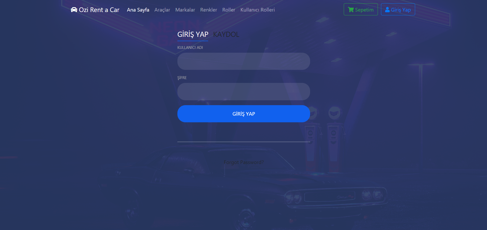
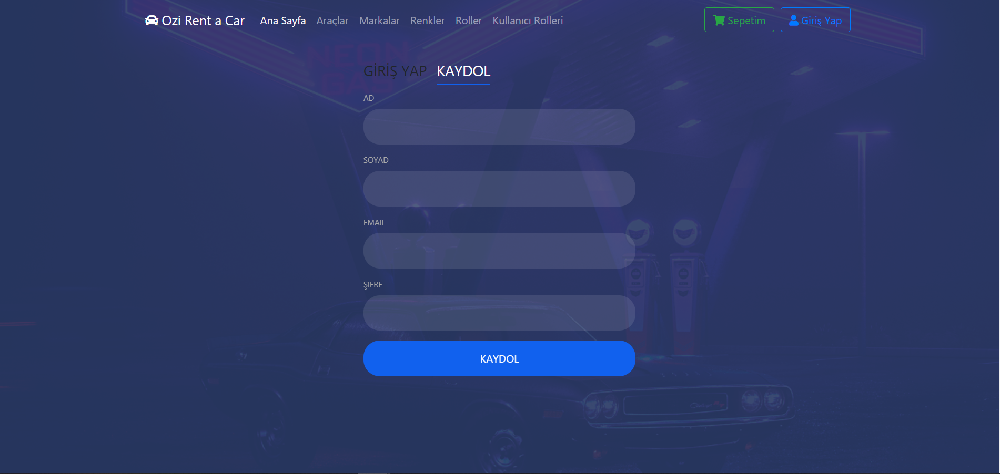

# Araç Kiralama Projesi (FrontEnd)

---

## Proje Hakkında Bilgiler

- Araç Kiralama Projesinin Backend tarafı .Net Core, Frontend tarafı ise Angular ile oluşturulmuştur.
- Backend kodlarına [bu linkten](https://github.com/oguzhanylcnkaya/ReCapProject) ulaşabilirsiniz.
- Frontend kodlarına [bu linkten](https://github.com/oguzhanylcnkaya/ReCapProjectFrontEnd) ulaşabilirsiniz.

### FrontEnd

Bu projenin Frontend tarafında Angular kullanılmıştır. Services klasörü altında wep abi tarafına hhtp request isteğinde bulunan gerekli servisler yazılmıştır. Bu servislerden gelen bilgileri karşılamak adına models klasörü altında varlıklar tanımlanmıştır. Proje de gerekli gösterimleri yapmak için ise components klasörü altında componentler oluşturulmuştur.

<!-- https://github.com/oguzhanylcnkaya/ReCapProjectFrontEnd/tree/master/src/assets/readme 

./src/assets/readme/
-->

## Ana Sayfa
---

- Yukarıdaki kısımda backend tarafından gelen araçlar listelenmektedir.
- Yandaki sidebar da araç markaları ve renkler listelenmektedir.
- Sidebardaki araç markalarına veya renklere tıklayınca ilgili araçlar gelmektedir.
- Sidebardaki marka ara ve renk ara inputları marka ve renk aratma işlemleri yapmaktadır.
- Tüm markalar ve tüm renkler de marka ve renkleri dropdown şeklinde listelemektedir.
- Bu dropdownlar yani açılır kutular ile de araç listeleme özelliklerini yapabilirsiniz.
- Hem belli bir marka hem de belli bir renk ile araçları listeyebilirsiniz. 
- Araba adı ara inputuyla da ilgili araba adlarını aratabilirsiniz.
- İlgili araçların detayına gidebilirsiniz, gerekli rollere sahipseniz ekleme ve güncelleme işlemlerini de yapabilirsiniz.

## Araba Detay Sayfası
---

## Araba Kiralama Sayfası
---

## Sepete Eklenenler Sayfası
---

## Ödeme Sayfası
---

## Giriş Yapma Sayfası
---

## Kayıt Olma Sayfası
---

## Arabalar Sayfası
---

## Araba Ekleme Sayfası
---

## Araba Güncelleme Sayfası
---

## Markalar Sayfası
---

## Marka Ekleme Sayfası
---

## Marka Güncelleme Sayfası
---

## Renkler Sayfası
---

## Renk Ekleme Sayfası
---

## Renk Güncelleme Sayfası
---

## Roller Sayfası
---

## Rol Ekleme Sayfası
---

## Rol Güncelleme Sayfası
---

## Kullanıcı Rolleri Sayfası
---

## Kullanıcı Rol Atama Sayfası
---

## Kullanıcı Rol Güncelleme Sayfası
---

## Kullanıcı Dropdown'u
---

## Kullanıcı Düzenleme Sayfası
---

---
###### Dipnot
Projenin tasarım kısmında ve projenin içindeki eksiklikler ile ilgili çalışmalara halen devam etmekteyim. Bu kısımları yaptıkça projeyi güncelleyeceğim. 

